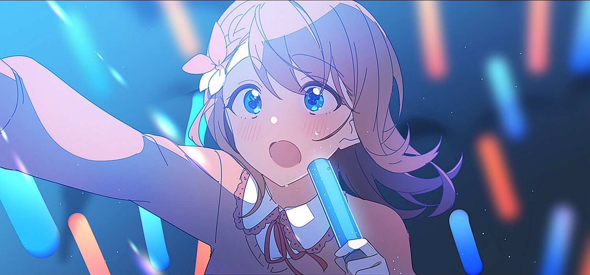

hi hey hello :>

I'm just a silly software development student living in Switzerland, currently attending the 42 school in Lausanne.
I have some C and web front-end experience- but that's about it! actively working to better myself and always learning new things :3

# skills!

<!--
**FireInsidE-fie/fireinside-fie** is a ✨ _special_ ✨ repository because its `README.md` (this file) appears on your GitHub profile.

Here are some ideas to get you started:

- 🔭 I’m currently working on ...
- 🌱 I’m currently learning ...
- 👯 I’m looking to collaborate on ...
- 🤔 I’m looking for help with ...
- 💬 Ask me about ...
- 📫 How to reach me: ...
- 😄 Pronouns: ...
- ⚡ Fun fact: ...
-->
